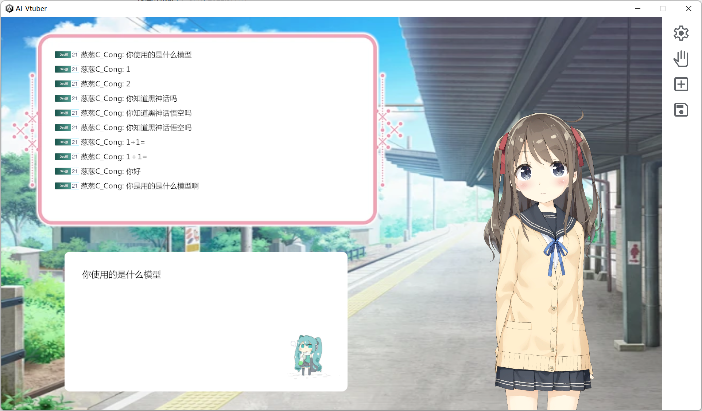

# AI-Vtuber-Client

构建所需版本：Unity 2022.3.41f1

OS：Windows 10或以上版本

LLM Api：智谱清言ChatGLM

TTS Api：GPT-SoVITS-Inference

## 如何构建

将项目 `clone` 到本地

```
git clone git@github.com:dgsyrc/AI-Vtuber-Client.git
```

使用Unity Hub将整个项目文件夹导入即可

## 如何部署

自行构建完成/release下载已构建版本后

前往下载GPT-SoVITS推理模块 [dgsyrc/GPT-SoVITS-Inference-pack](https://github.com/dgsyrc/GPT-SoVITS-Inference-pack) （请下载release版本，含推理模块的预训练模型）

运行 `PyStand.exe` 自动下载推理模块所需依赖包，下载完成后运行 `start.bat` 启动模块服务

LLM的Api已经集成在程序中，无需另外构建

GPT-SoVITS推理模块启动完成后即可运行构建好的程序 `AI-Vtuber.exe`

直播间号以及rtmp推流链接在程序设置界面可自行设置

rtmp链接示例：

```
rtmp://live-push.bilivideo.com/live-bvc/?streamname=
```

如果没有 `virtual audio capture` ,需要使用管理员模式运行 `Assets\StreamingAssets\reg.bat` 安装 （release版本则运行 `AI-Vtuber_Data\StreamingAssets\reg.bat`）
